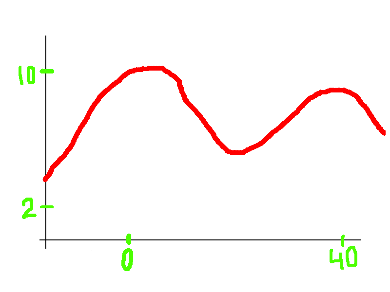
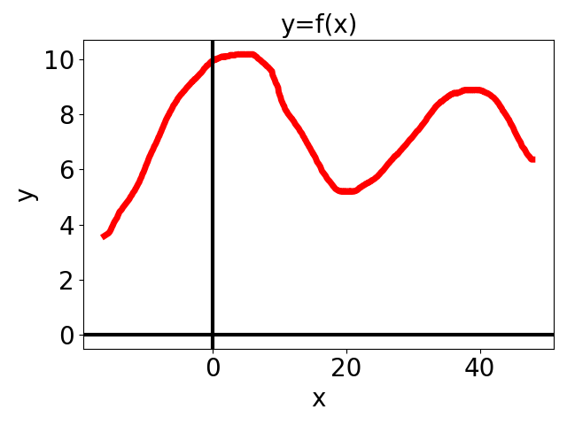
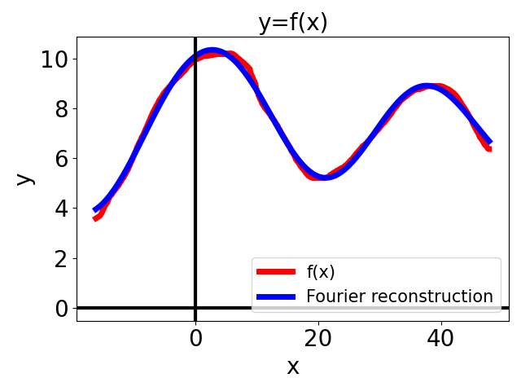

# pic2func
Convert a self-drawn y=f(x) function (PNG or SVG) into a numpy (x,y) array or its DFT reconstruction.

# Usage
Color conventions are used to extract data. See /example/ for a working example.

0. For best performance, disable antialiasing for drawing (use a hard brush).

1. Draw the x (y) axis as a horizontal (vertical) black line. They need not cross.

2. Draw your (injective) function in red (RGB = 255,0,0). Function may cross the axes.

3. Draw green tickmarks on the axes (RGB = 0,0,255).

4. Draw green tickvalues near the tickmarks (RGB = 0,0,255). Negative tickvalues are not supported. Restricted to natural numbers (including 0).

5. Save as PNG or SVG image. 

6. Run function_from_image to get the (x,y) values of the drawn function. Run fourier_function_from_image to also obtain the DFT fourier components.

### Example
See /example/ for the code. 

Input: *test.png*

Plots of *function_from_image("test.png")* output and *fourier_function_from_image("test.png", n=5)* output

# Installation
1. Clone the repository.

2. Create a conda environment and run **pip install .** or **python setup.py install** in the git folder.

2. Create a virtual environment and run **python -m pip install --upgrade pip** followed by **python -m pip install .** or **python -m setup.py install** inside the git folder